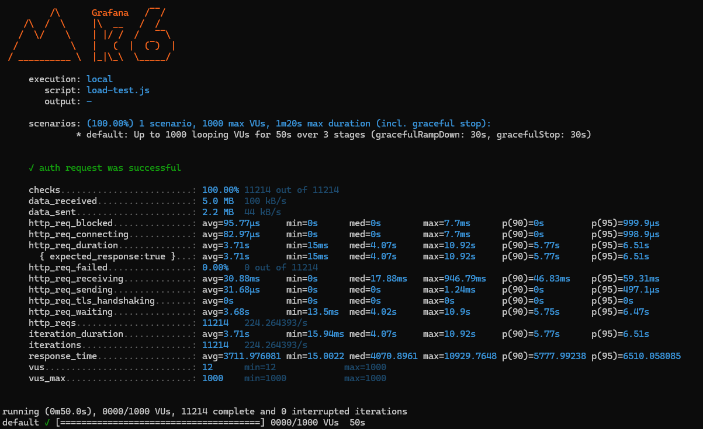

# Avito Merch Shop API

Тестовое задание для стажёра Backend-направления (зимняя волна 2025)

## Описание

Сервис для внутреннего магазина мерча Avito с возможностью:
- Покупки товаров за монеты
- Передачи монет между пользователями
- Просмотра истории операций
- Автоматической регистрацией новых пользователей

## Технологии

- ASP.NET Core 8
- Entity Framework Core
- PostgreSQL
- Swagger/OpenAPI
- Docker
- JWT-аутентификация
- xUnit (тестирование)
- K6 (Нагрузочное тестирование)

## Запуск проекта

1. Клонировать репозиторий:
```bash
git clone https://github.com/yourusername/avito-merch-shop.git
cd Avito-Backend-Trainee-Assignment-Winter-2025
```
2. Запустить сервисы:

```bash
docker-compose up
```  

Сервис будет доступен по адресу:
```
http://localhost:8080
Swagger UI: http://localhost:8080/index.html
```  

## Использование API
### 1. Аутентификация
**POST /api/auth**  
Пример запроса:

```json
{
  "username": "testUser",
  "password": "testPass123"
}
```

### 2. Получение информации
**GET /api/info**  
Требует JWT-токен в заголовке:

```
Authorization: Bearer <your_token>
```
### 3. Перевод монет
**POST /api/sendCoin**  
Пример запроса:
```json

{
  "toUser": "anotherUser",
  "amount": 100
}
```
### 4. Покупка товара
**GET /api/buy/{item}**  
Доступные товары:  
```
t-shirt, cup, book, pen, powerbank, 
hoody, umbrella, socks, wallet, pink-hoody
```
## Особенности реализации
* Автоматическая регистрация при первом входе

* Транзакционные операции с повторными попытками

* Оптимизация для высоких нагрузок:

  * Уровень изоляции Repeatable Read

  * Атомарные SQL-обновления

  * Экспоненциальная задержка при конфликтах

* Полная документация через Swagger

* Поддержка 100k+ пользователей

## Нагрузочное тестирование
Результаты нагрузочного тестирования приведены на рисунке ниже:

Код теста приведен здесь:
```js
import http from 'k6/http';
import { check } from 'k6';
import { Trend } from 'k6/metrics';

// Метрика для времени отклика
let responseTimeTrend = new Trend('response_time');
let iter = 0;
export let options = {
  stages: [
    { duration: '10s', target: 1000 }, // За 30 секунд увеличиваем нагрузку до 1000 пользователей
    { duration: '30s', target: 1000 },  // Держим 1000 пользователей в течение 1 минуты
    { duration: '10s', target: 0 }  // Постепенно уменьшаем нагрузку до 0
  ],
};

export default function () {
   
  // Делаем POST-запрос на /api/auth для получения токена
  let authResponse = http.post('http://localhost:8080/api/auth', JSON.stringify({
    Username: 'validUsername' + iter,
    Password: 'validPassword'
  }), {
    headers: { 'Content-Type': 'application/json' },
  });
  iter=iter+1;
  // Проверка, что токен успешно получен
  check(authResponse, {
    'auth request was successful': (r) => r.status === 200,
  });


  // Логируем время отклика
  responseTimeTrend.add(authResponse.timings.duration);
}

```